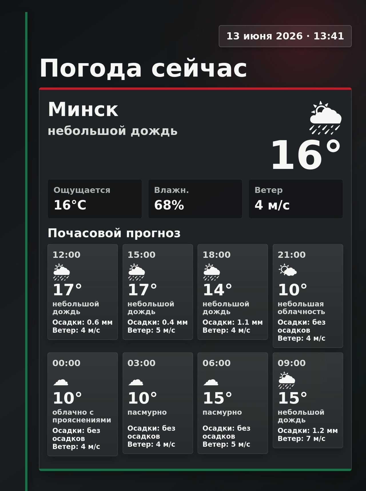
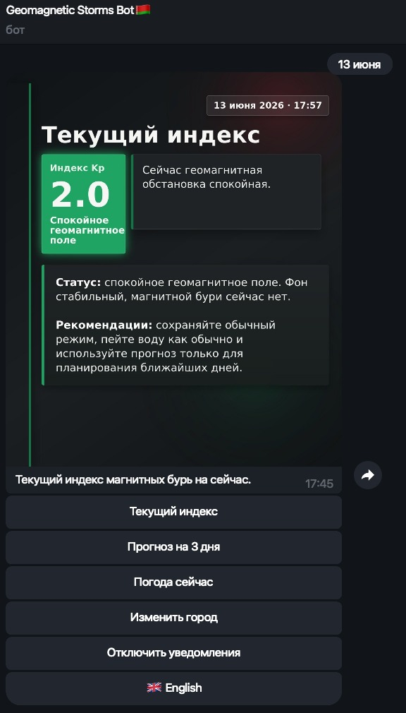
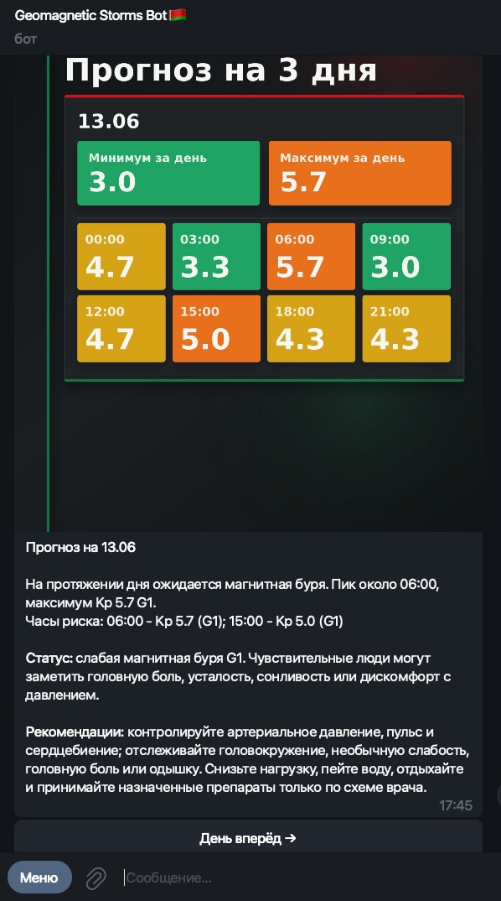
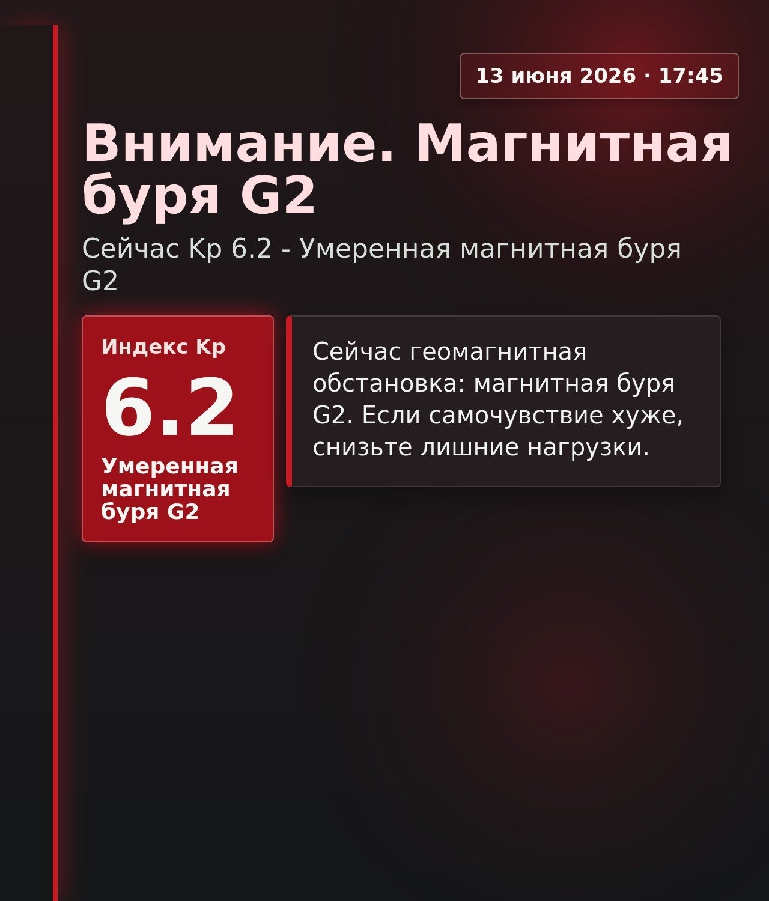

# Geomagnetic & Weather Telegram Bot for Belarus

C++17 Telegram bot that shows current geomagnetic activity, NOAA Kp forecasts,
weather for Belarusian locations, and scheduled storm notifications.

## Telegram UI Preview

Real rendered bot screens prepared for README. Runtime chat ids, message ids,
tokens, and local state are not included.

<p align="center">
  
  
</p>

<p align="center">
  
  
</p>

## Features

- Real-time geomagnetic status from NOAA SWPC.
- 3-day geomagnetic forecast with Kp-based risk labels.
- Weather for Belarusian cities and villages through OpenWeatherMap.
- Russian, Belarusian, and English interface text.
- Morning reports and storm alerts for subscribed users.
- HTML/CSS screen templates rendered to Telegram images with `wkhtmltoimage`.
- Text fallback when image rendering is unavailable.
- Local flat-file persistence for small self-hosted deployments.

## Tech Stack

| Component | Technology |
| --- | --- |
| Language | C++17 |
| HTTP | CPR over libcurl |
| JSON | nlohmann/json |
| Rendering | HTML/CSS + wkhtmltoimage |
| Scheduling | C++ threads |
| Build | Make |
| Weather API | OpenWeatherMap |
| Geomagnetic API | NOAA SWPC |

## Repository Layout

```text
.
├── geomagnetic_bot_by.cpp        # Bot logic, Telegram handlers, API clients
├── src/template_engine.*         # Small template replacement helper
├── templates/screen.html         # Telegram image HTML shell
├── templates/screen.css          # Telegram image visual style
├── deploy/geobot.service.example # systemd unit example
├── assets/screenshots/           # README screenshots
├── .github/workflows/ci.yml      # GitHub Actions build/test workflow
├── .env.example                  # Environment variable placeholders only
└── Makefile
```

## Dependencies

On Debian/Ubuntu:

```bash
sudo apt-get update
sudo apt-get install -y \
  build-essential \
  make \
  libcurl4-openssl-dev \
  libssl-dev \
  libcpr-dev \
  nlohmann-json3-dev \
  wkhtmltopdf
```

`wkhtmltoimage` is provided by the `wkhtmltopdf` package on Debian/Ubuntu. The
bot uses it to render Telegram live screens as JPEG images. If it is missing,
the bot sends text fallback messages instead of failing the whole flow.

If your distribution does not provide `libcpr-dev`, install CPR from your
package manager, vcpkg, or the upstream CPR project, then keep the linker flags
from the `Makefile`.

## Build and Test

```bash
make
make test
```

The test target builds the bot with `-DUNIT_TEST` and runs local checks for
normalization, localization helpers, escaping, Kp labels, and renderer support.

## Configuration

Create a private `.env` from the public example:

```bash
cp .env.example .env
```

Then set real values locally:

```bash
TG_BOT_TOKEN=replace_with_your_telegram_token
OPENWEATHER_API_KEY=replace_with_your_openweathermap_key
GEOBOT_DEV_CHAT_ID=
```

Required variables:

| Variable | Purpose |
| --- | --- |
| `TG_BOT_TOKEN` | Telegram Bot API token |
| `OPENWEATHER_API_KEY` | OpenWeatherMap API key for weather screens |

Optional variables:

| Variable | Purpose |
| --- | --- |
| `GEOBOT_DEV_CHAT_ID` | Enables local-only testing commands for one chat |

Run locally:

```bash
./bot
```

## systemd Deployment

Use the provided unit as a starting point:

```bash
sudo cp deploy/geobot.service.example /etc/systemd/system/geobot.service
```

Create a private environment file outside the repository:

```bash
sudo mkdir -p /etc/magnetic_storm_by
sudo nano /etc/magnetic_storm_by/geobot.env
```

Example content:

```ini
TG_BOT_TOKEN=replace_with_your_telegram_token
OPENWEATHER_API_KEY=replace_with_your_openweathermap_key
GEOBOT_DEV_CHAT_ID=
```

Adjust `User`, `Group`, `WorkingDirectory`, and `ExecStart` in the service file
for your server path. Then enable the service:

```bash
sudo systemctl daemon-reload
sudo systemctl enable geobot.service
sudo systemctl start geobot.service
```

Check logs:

```bash
journalctl -u geobot.service -f
```

## Runtime Data and Privacy

The bot creates local state files in the working directory:

- `users.txt`
- `cities.txt`
- `notifications.txt`
- `language.txt`
- `live_messages.txt`
- `supplement_messages.txt`
- `bot_screens/`

These files can contain Telegram chat ids, message ids, selected cities, and
rendered private screens. They are intentionally ignored by git and must not be
committed or attached to public issues.

Before publishing changes, verify the public surface:

```bash
git status --short --ignored
git ls-files
git grep -n -E "(TG_BOT_TOKEN|OPENWEATHER_API_KEY|BOT_TOKEN|api[_-]?key|token|secret|password)"
```

The grep command should only find placeholder names or source code references
to environment variable names, not real values.

## Screen Templates

Telegram images are rendered from editable templates:

- `templates/screen.html` - outer HTML shell.
- `templates/screen.css` - visual style, layout, colors, typography.

The bot reads these files whenever it renders a new screen. CSS/HTML changes do
not require recompiling C++; trigger a new screen render in Telegram or restart
the service if you want a clean runtime state.

## Public Bot

Telegram: `@geomagnetic_belarus_bot`

## License

MIT. See [LICENSE](LICENSE).
