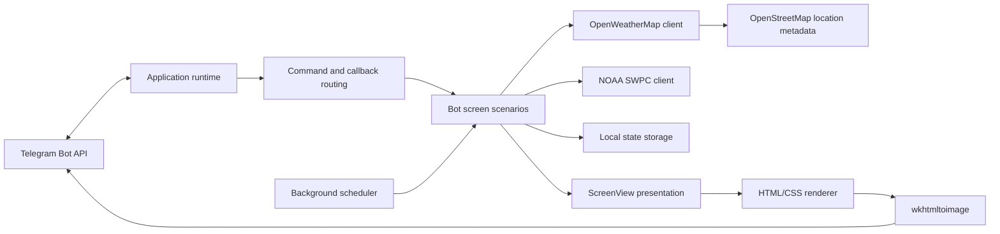

# Geomagnetic & Weather Bot

[](https://github.com/entropia5/magnetic_storm_by/actions/workflows/ci.yml)
[](https://en.cppreference.com/w/cpp/17)
[](LICENSE)

A self-hosted C++17 Telegram bot for geomagnetic activity and local weather in
Belarus. It combines NOAA space-weather data with OpenWeatherMap forecasts and
OpenStreetMap location metadata, renders a live visual dashboard, and sends
scheduled storm notifications and morning reports.

**Try the public bot:** [@geomagnetic_belarus_bot](https://t.me/geomagnetic_belarus_bot)

## Preview

<p align="center">
  
  
</p>

<p align="center">
  
  
</p>

## Highlights

- Current planetary Kp index from NOAA SWPC.
- Three-day geomagnetic storm forecast with daily minimums, maximums, and
  three-hour Kp intervals.
- Current weather and an eight-slot hourly forecast for Belarusian locations.
- Settlement-aware location labels such as city, village, and settlement,
  including the special title “Hero City Minsk”.
- Russian, Belarusian, and English interfaces.
- Per-user city, language, and notification settings.
- Morning reports and configurable geomagnetic storm alerts.
- Live Telegram dashboard updated through message editing.
- Balanced HTML/CSS dashboard cards rendered to JPEG with a text-only fallback.
- Atomic local persistence for lightweight self-hosted deployments.
- Modular C++ architecture with automated build and test workflow.

## Architecture

The project separates external services, application scenarios, presentation,
rendering, persistence, and runtime orchestration.



Important modules:

| Module | Responsibility |
| --- | --- |
| `app_runtime` | Startup, configuration, Telegram long polling |
| `bot_screens` | User-facing application scenarios |
| `callback_handler` | Inline keyboard routing |
| `scheduler` | Morning reports and storm checks |
| `weather_*` | Weather requests, forecasts, and settlement classification |
| `geomagnetic_client` | NOAA Kp index and forecast retrieval |
| `telegram_*` | Telegram transport, live screens, and fallbacks |
| `screen_*` | HTML composition and JPEG rendering |
| `storage` | Users, preferences, and message state |
| `localization` / `translations` | Language selection and text catalog |
| `presentation` | Kp, weather, and report formatting |

## Technology

| Area | Technology |
| --- | --- |
| Language | C++17 |
| HTTP | CPR / libcurl |
| JSON | nlohmann/json |
| Rendering | HTML, CSS, wkhtmltoimage |
| Concurrency | Standard C++ threads and mutexes |
| Build | GNU Make |
| CI | GitHub Actions |
| Weather | OpenWeatherMap |
| Places | OpenStreetMap Nominatim |
| Space weather | NOAA Space Weather Prediction Center |

## Repository Structure

```text
.
├── src/
│   ├── main.cpp                 # Minimal entry point
│   ├── app_runtime.*            # Startup and polling loop
│   ├── bot_screens.*            # Application scenarios
│   ├── weather_*.*              # Weather integration
│   ├── geomagnetic_client.*     # NOAA integration
│   ├── telegram_*.*             # Telegram transport
│   ├── screen_*.*               # Rendering pipeline
│   ├── storage.*                # Persistence
│   └── localization.*           # Localization logic
├── tests/test_main.cpp          # Unit and renderer checks
├── templates/                   # Runtime HTML/CSS templates
├── assets/screenshots/          # Public UI examples
├── deploy/geobot.service.example
├── .github/workflows/ci.yml
└── Makefile
```

## Building

### Dependencies

On Debian or Ubuntu:

```bash
sudo apt-get update
sudo apt-get install -y \
  build-essential \
  make \
  libcurl4-openssl-dev \
  libssl-dev \
  libcpr-dev \
  nlohmann-json3-dev \
  wkhtmltopdf
```

`wkhtmltoimage` is distributed in the `wkhtmltopdf` package. It is optional at
runtime: if it is unavailable, the bot sends text messages instead of rendered
screens.

If `libcpr-dev` is unavailable in your distribution, install CPR through its
upstream build, vcpkg, or another package manager.

### Compile and test

```bash
make
make test
```

The test target builds a separate test executable. Current checks cover
localization, command parsing, location normalization, Kp classification,
precipitation formatting, Telegram error handling, HTML escaping, templates,
and rendered screen dimensions.

## Configuration

Create a local configuration file:

```bash
cp .env.example .env
```

Set the required credentials:

```dotenv
TG_BOT_TOKEN=your_telegram_bot_token
OPENWEATHER_API_KEY=your_openweathermap_key
```

Optional development setting:

```dotenv
GEOBOT_DEV_CHAT_ID=
```

| Variable | Required | Description |
| --- | --- | --- |
| `TG_BOT_TOKEN` | Yes | Token created with Telegram BotFather |
| `OPENWEATHER_API_KEY` | For weather | OpenWeatherMap API key |
| `GEOBOT_DEV_CHAT_ID` | No | Enables development-only preview commands for one chat |

Environment variables take precedence over `.env` values.

Run the bot:

```bash
./bot
```

## Screen Customization

The live dashboard is driven by:

- `templates/screen.html` — document shell;
- `templates/screen.css` — layout, colors, typography, and responsive variants.

The templates are loaded at runtime. CSS-only visual changes therefore do not
require recompiling the C++ application. Changes to screen content or view
composition still require a rebuild.

### Updating the public screenshots

The README uses four stable image paths:

```text
assets/screenshots/weather-current.jpg
assets/screenshots/geomagnetic-current.jpg
assets/screenshots/geomagnetic-forecast.jpg
assets/screenshots/storm-alert.jpg
```

Replace these files with screenshots from the current bot version while
keeping the same names. GitHub will then show the updated interface without
any README link changes. Before publishing, make sure screenshots do not
contain private chat IDs, usernames, tokens, or other personal data.

## Deployment

A systemd service example is available in
`deploy/geobot.service.example`.

```bash
sudo cp deploy/geobot.service.example /etc/systemd/system/geobot.service
sudo mkdir -p /etc/magnetic_storm_by
sudo nano /etc/magnetic_storm_by/geobot.env
```

Adjust `User`, `Group`, `WorkingDirectory`, and `ExecStart` in the copied unit,
then start the service:

```bash
sudo systemctl daemon-reload
sudo systemctl enable --now geobot.service
journalctl -u geobot.service -f
```

## Privacy and Runtime Data

The bot stores small amounts of local runtime state:

```text
users.txt
cities.txt
notifications.txt
language.txt
live_messages.txt
supplement_messages.txt
bot_state.json
bot_screens/
```

These files may contain Telegram chat IDs, message IDs, selected cities, or
rendered private screens. They are excluded through `.gitignore` and must not
be published.

Credentials are read from environment variables or ignored local `.env` files.
Never commit real bot tokens or API keys.

## Limitations

- Persistence is designed for a small self-hosted bot, not a distributed
  multi-instance deployment.
- Scheduling currently uses the Belarus time zone expected by this service.
- Weather features depend on OpenWeatherMap availability and API limits.
- Settlement classification depends on OpenStreetMap Nominatim availability.
- Generated health guidance is informational and is not medical advice.

## License

Distributed under the [MIT License](LICENSE).
